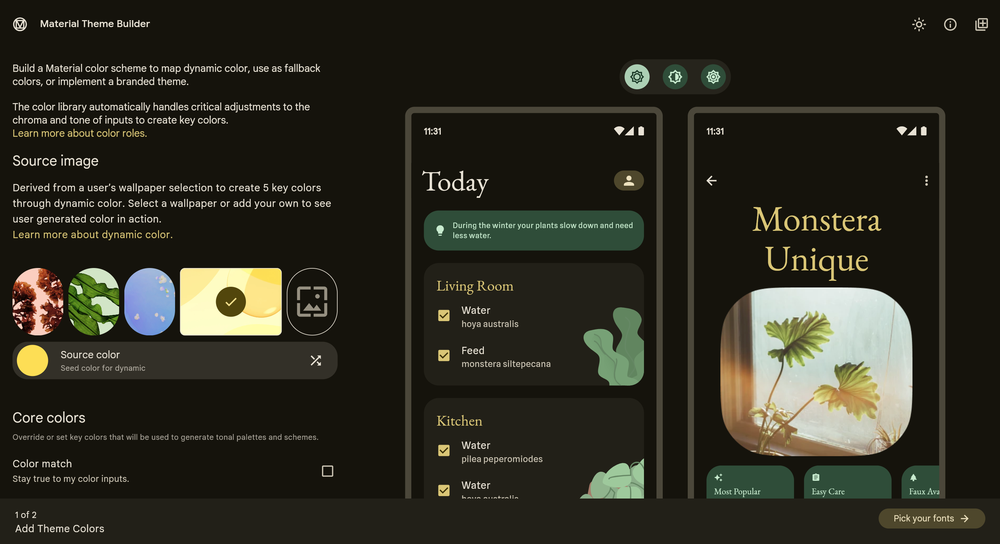
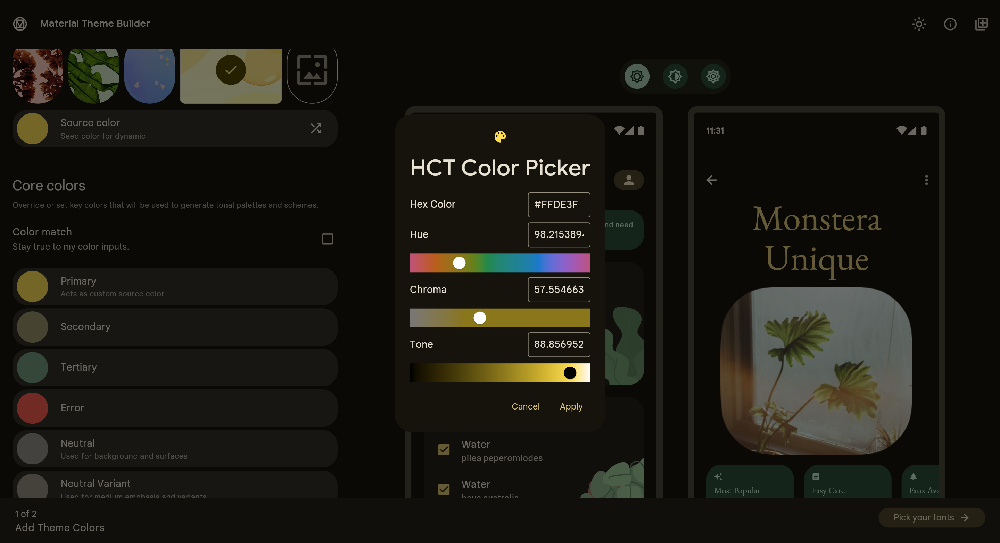

# Lab 03 Expense Tracker app - lab

## WARNING

1. Please **do not** merge the **lab code into the master branch** again. After submitting, navigate to the course public folder (courses > software-studio > 2025-spring > lab-flutter-basics-dart-expense-tracker-app), and click on 'Merge Requests' on the left. Search for your student ID and check your merge request. Confirm that 'Request to merge (your student ID: your branch) into (your student ID)' is displayed, where (**your branch**) should usually be **master**, and 'into (**your student ID**)' should show your own **student ID**.

2. We will only approve your merge request at the **end of the lab**, and at **11:59 PM**. During the lab, if you wish to submit a new merge request, please ensure you **close your previous one first**. After the lab, you can submit a new merge request without closing the old one. However, if you plan to submit a second merge request after the lab, make sure to **close the first one** before doing so.

3. If you find that you have submitted an **incorrect merge request**, please **delete** it for us.

If the above situation occurs, points will be **deducted from the original score, multiplied by 0.6.** Please pay special attention.

If an error is found, the safest way to proceed is to click "Close merge request" below and resend a merge request.

## Lab Description
In this lab course, you will be tasked with implementing **three functions** that were discussed in class.

The first part is to implement the **chart**, described as follows:

 ( 40% )  
   

After entering values from the form, the chart will display the difference in bar heights between each category, reflecting the proportion of each item's total amount.

    

The second part is to implement the **form**, described as follows:

The Invalid Input warning displayed in the sample program is as follows. 
   

 ( 30% )  
Now, you need to modify it to utilize a Form to implement this area and display the warning below each text field as shown below.
   

The third part is to implement the **Customized Theme**, described as follows:

   

 ( 30% )  
Utilize the Material Theme Builder to configure the theme and dark theme (with a free choice of colors) for your application theme.

   

## Deadline
Submit your work before 2024/03/14 (Thur.) 17:20:00.

The score you have done will be 100%.

Submit your work before 2024/03/14 (Thur.) 23:59:59.

The score of other part you have done after 17:20:00 will be 60%.

# Resources

A few introductory tutorials crafted to assist you in completing today's lab.

- [Chart bar implementation](https://api.flutter.dev/flutter/widgets/FractionallySizedBox-class.html)
    * Pay particular attention to the heightFactor or widthFactor of the FractionallySizedBox.
- [Form](https://dev.to/aspiiire/easy-way-to-write-forms-in-flutter-37ni)
- [Material Theme Builder](https://m3.material.io/theme-builder#/custom)
