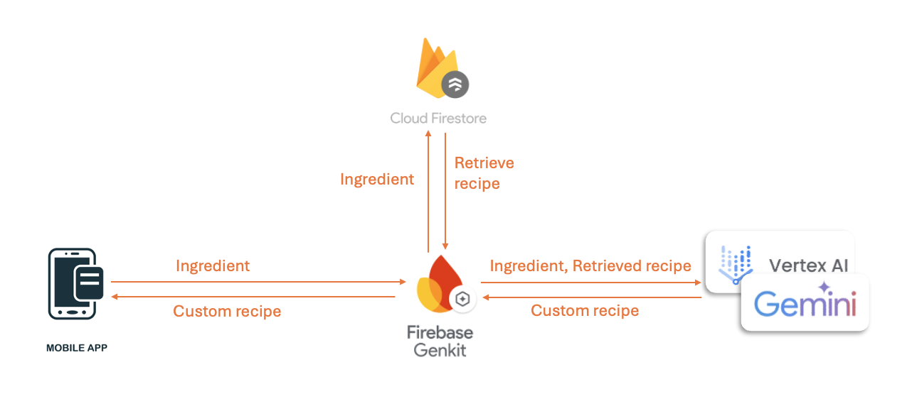
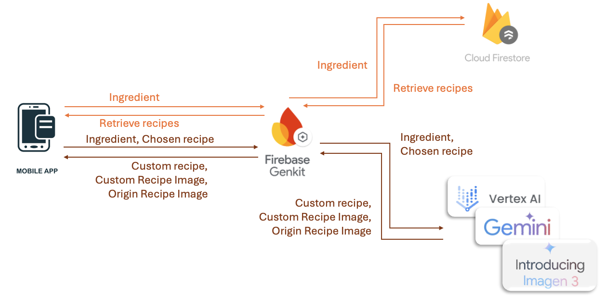

# Lab 04 - Recipe app

In this lab, you will learn how to use genkit to build the agentic flows, deploy them onto the firebase function, and call them using flutter.

The original code implement the flow of RAG: calling a retriever and generate the custom recipe.

You are going to modify the flow into two: the first one retrieve five relevant datas and return. The second one generate the custom recipe and the images.

Before you start to do the lab, make sure you have completed the setting of firebase, vertexAI, and genkit.
## Grading
(30%) retrieveRecipeFlow 

(1) (25%) Create a new flow called **retrieveRecipeFlow** in`/functions/src/flow/retrieveRecipe.ts`. This flow should take the user's ingredients as input, query the retriever, and return **five** relevant recipes. 

(2) (5%) Ensure the **input and output schemas** are well-defined.

(30%) Modify the flow **customRecipeFlow** so that it: 
- Takes the user's ingredients and a selected recipe as input.
- Generates a custom recipe based on the input.
- According to recipes, outputs images of both the original dish and the customized dish.
- The image generation prompt is predefined.

(10%) Deploy two flows onto firebase function.

(15%) Modify the function **retrieveRecipes** in **fetch_recipes** so that you can call **retrieveRecipeFlow**.
- Make sure return value and type is correct. (any change is no need in UI since you return the right value).

(15%) Modify the function **customRecipes** in **fetch__custom_recipe** so that you can call **customRecipeFlow**.
- Make sure return value and type is correct. (any change is no need in UI since you return the right value).

## Deadline
Submit your work before 2025/04/03 (Thur.) 17:20:00.

The score you have done will be 100%.

The score of other part you have done after 17:20:00 will be 0%.

## Resources
[firebase genkit](https://firebase.google.com/docs/genkit)

